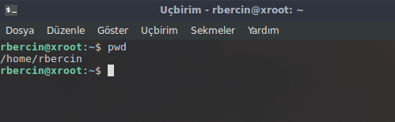

### Temel Komutlar

**pwd** : (_print working directory_) çalışılan dizini yazdır, anlamına gelmektedir.

**ls** : İçinde bulunduğumuz dizinin altında hangi dizinler ve dosyalar var onları listelememize yarıyor. "ls" komutu artı olarak parametre almaktadır.

- **ls -l** : Uzun liste long list anlamına gelir.
- **ls -la** : (All) Artı olarak gizli dosyalarıda listelemektedir. (_linux dosya yapısında ".dosya" nokta ile başlayanlar gizlidir._ ) **Not** : "ls -al" olarakda aynı işlemi yapabilirsiniz.
- **ls -lar** : (r -reverse) Gizli dosyalar da dahil  alfabetik sıraya göre sondan başlayarak içerikleri listeler.
- **ls -lt** : (t -time) Zamana göre listeliye biliyoruz.
-  **ls -ltr** : (t -time) Zamana göre tersine listeliye biliyoruz.
  
**cd** : (_Change Directory_) Dizin değiştirme işlemi yapabiliyoruz. Kullanımı : cd "yol" ,  Ör ; cd Desktop (Masaüstü dizinine gider) cd .. bir dizin geri gelir.

**mkdir** : (_Make Directory_) Dizin oluşturma işlemi yapabiliyoruz. Kullanımı : mkdir _klasörAdı_ , boşluk içeren bir dizin adı vereceksek 1.yol ; **mkdir "test deneme"** 2. yol ; mkdir test\ deneme şeklinde kullanmalıyız.

**touch** : Dosya oluşturma işlemi yapabiliyoruz. Kullanımı : touch _dosyaAdi_  boşluk içeren bir dizin adı vereceksek 1.yol ; **touch "test deneme"** 2. yol ; **touch test\ deneme** şeklinde kullanmalıyız.

**cat** : Düz metin dosyalarının içeriğini ekrana yazar. Diğer bir parametresi **cat > 'yeni dosya'** --> yeni dosya açıp içine yazı yazmamızı sağlar, yazı yazdıktan sonra çıkmak için ctrl + d 'e basarak çıkabilirsiniz.

**less** : Bir dosya içeriği veya komut sonucunu ekranda sayfalı bir şekilde gösterir (ileri - geri ) hareketlere izin verir. kullanım ; **less dosyaAdi** dosyanın içine girer, terminal dosya haline bürünür, çıkmak için **q** 'a basarız. ör ; **ls -la | less** şeklinde de konut çıktısı üzerinde kullanabiliriz.

**rm** : (_Remove_) Dosya silmek için kullanırız.

**rmdir** : Dizin silmek için kullanırız. Dizin için de dizin varsa bu komut silemez, onun için ;
- **rm -r dizinadi/** komutu ile silebiliriz. Dikkat etmemiz gereken şey ise bu komut ile sildiğimiz dizin ve dosyalar çöp kutusuna gitmez.

**cp** : (_copy_) dosya ve dizin kopyalama işlemi yapmak için kullanılır. Kullanım ; **cp dosyaAdi KopyalanacakYer** şeklinde kullanımı vardır.

**mv** : (_move_) Dosya ve dizin taşımak için kullanımı vardır, taşıdığımız dosyanın ismini değiştirmemizi de sağlar. Kullanım ; **mv dosyaAdi TaşımaYolu/YeniAdı** şeklinde kullanabiliriz. ör ; **mv denemeDosyasi ../TestDosyasi** --> denemeDosyasi dosyasini bir üst dizine TestDosyasi dosyasi adında taşıdık.

