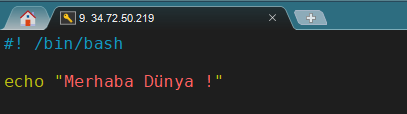
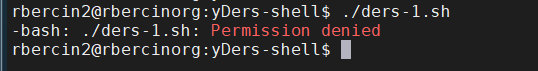
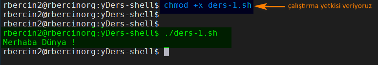
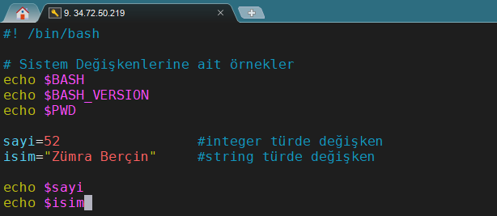
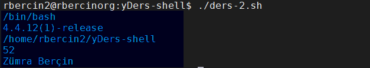

#### Bash Script Nedir ?
Bash script Unix'te mevcut olan programlama araçlarından biridir. Bash Script'in açılımı **Bourne Again Shell**'dir. Linux kullanıcıları ve Sistem Yöneticileri için güçlü bir araçtır. Bir çok tekrarlı işleri bash script ile yazılan program ile daha kolay hale getirebiliriz.

#### Bash Script Kullanımı

 `#! /bin/bash` bu satır sonraki alt satırların hangi kabuk tarafından yorumlanacağını bildiren standart bir tanımdır ve her bash  scriptinde bulunmalıdır.  Betik dosyalarının uzantısı genellikle `*.sh` 'dır.

 Sistemde kullanılabilir shell programlarını görmek için terminal komut satırına `cat/etc/shells` yazıp çalıştırdığımızda görebiliriz. Terminalde hangi shell'de çalıştığımızı görmek için `which bash` yazdığımızda bize yolunu gösterecektir.
 
 ##### ilk uygulamamızı yazalım 
 Ben unix sistemlerde bulunan `vi` editörü kullanarak uygulamayı yazacağım.
 Terminal ekranından `vi uyg-1.sh` yazdığımda editor boş bir sayfa açıyor aşağıdaki komutları yazıp klavyeden `esc` basıyoruz sonra `:wq!` yazıyoruz. Bu işlem `vi` editöründe yapılan değişiklikleri kaydet ve çık anlamına gelmektedir.  Kaydetmeden çıkmak için ise `:q!` yazmamız yeterli.

yazdığımız uygulamayı şimdi çalıştıralım. Terminalde yazdığımız uygulamanın bulunduğu dizine gidip bu komutu  `./ders-1.sh` yazdığımızda uygulamanın çalışması gerekmektedir.

Ekranda görüldüğü gibi `Permission denied` hatası verdi, bunun sebebi ise uygulama dosyamız `executable` çalıştırıla bilir dosya olmadığı için bu hatayı verdi.

Uygulama dosyamıza yetki verelim bunun için komut satırına  `chmod +x ders-1.sh` yazmamız gerekmektdir. 

>şimdi yeniden çalıştıralım. `./ders-1.sh` dedik ve ekrana Merhaba Dünya ! yazdı. 

Süper :)  ilk uygulamamızı yazdık ♥ 

#### Değişkenler 
Kullandığımız 2 çeşit değişkenle vardır bunlar ;
1. Sistem Değişkenleri (System Variables)
2. Kullanıcı Değişkenleri (User Variables)

**örnek 1:** Sistem değişkenleri : `$BASH` , `$BAHS_VERSION` , `$HOME` gibi bir çok deikan vardır.
**örnek 2:** Kullanıcı deişkenleri : `sayı=52` integer bir değişken, `isim = Zümra Berçin` string bir değişken 

>komut satırından çalıştıralım.

