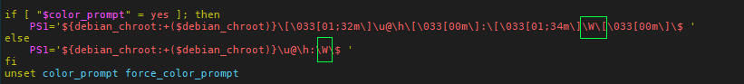

##### Terminalde uzun dosya yolunu gizleme, en son girilen dizini gösterme

Terminal komut satırında `vi .bashrc` ile .bashrc dosyasının içine giriyoruz ve  resimde de görüldüğü gibi  \w geçen yere \W (büyük W) yazıyoruz. Daha sonra `source .bashrc` komutu ile değişiklikleri aktif ediyoruz. 

{:.lightbox}
[vi .bashrc](../assets/kisa-kisa-linux/dosya-yolu-gizleme.png){:.lightbox}

[video link](https://youtu.be/iWowJBRMtpc?t=90s){:.no-lightbox}

